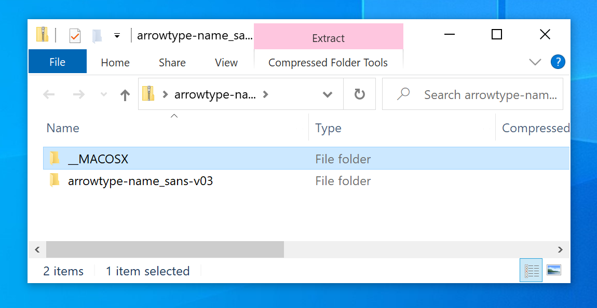
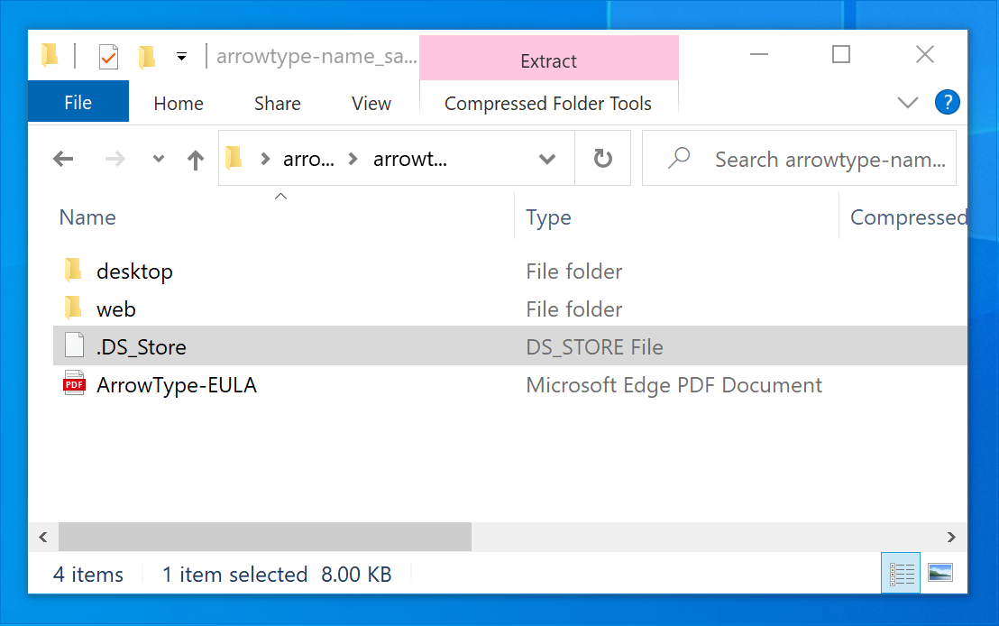
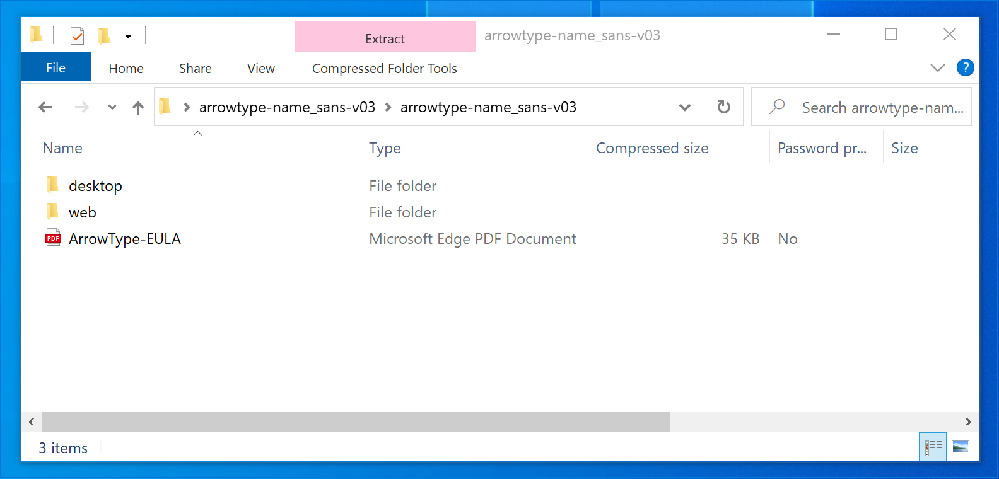

# Making better zip files for Windows by excluding unnecessary .DS_Store & MACOSX files

## The Problem

Something unexpected that I learned recently: if you are on a Mac and make a zip of a folder in a regular way (e.g. by right-clicking a folder, then selecting ‘compress’, or with a basic usage of the `zip` command-line utility), it includes obnoxious, unnecessary files for folks that decompress those zips on Windows computers.

1. The top level will have an empty `MACOSX` folder
2. Every other level will have an unnecessary `.DS_Store` file





My vague understanding of these files is that they somehow help macOS deal will making backups. However, these aren’t helpful in zipped folders, and if you send these zips to Windows users, they are especially unhelpful.

## The Solution

To avoid this, you can compress a folder on the command line. Use `cd` to navigate to its parent directory, then use this command (replacing arrowtype-name_sans-v03 with the appropriate folder name):

```
zip arrowtype-name_sans-v03.zip -r 'arrowtype-name_sans-v03' -x '*/.DS_Store'
```

This command is somewhat finnicky, and may not work as expected if you change or leave out the single quotes. The best way to be sure it worked as you expect is to try opening it in Windows (whether on an actual PC or via a virtual machine using software like VMWare or Parallels). If this isn’t feasible, at least open the zip on your Mac to check that the structure is what you expect. If it’s not, you may need to try again, perhaps with adjusted paths.

## The Result

When you exclude the `.DS_Store` files, it avoids both problems, and the result is much cleaner:


