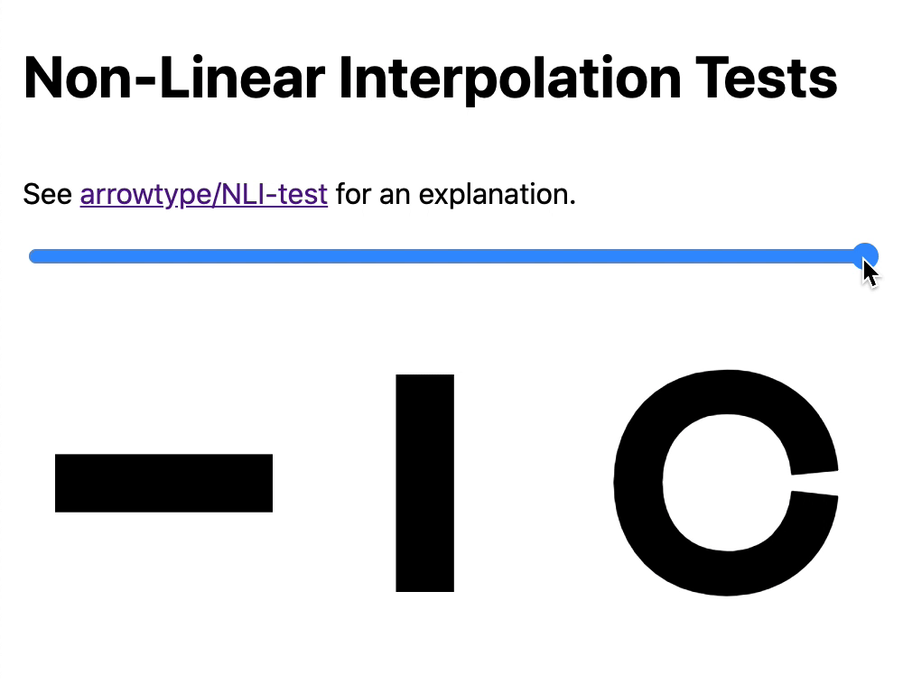

# Exploring Non-Linear Interpolation

Ever since [Underware Type started exploring HOI](https://underware.nl/case-studies/hoi/), I’ve amazed by the tech & possibilities, and I’ve wanted to try it myself.

For a long time, I didn’t get it. Then, I started to understand it, but felt like actually making it work would be nearly impossible (or super inefficient, at best). But, I’ve taken another look, and using a slightly-simplified “quadratic” approach, it now feels much more within reach.

To explore this and share my findings, I’ve made some tests sources, a [web demo](https://arrowtype.github.io/NLI-test/index.html), and a written explanation at [github.com/arrowtype/NLI-test](https://arrowtype.github.io/NLI-test/).

Hopefully this helps someone else understand it a little better, too!
